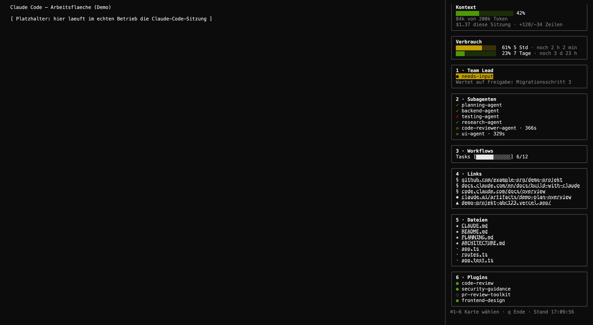
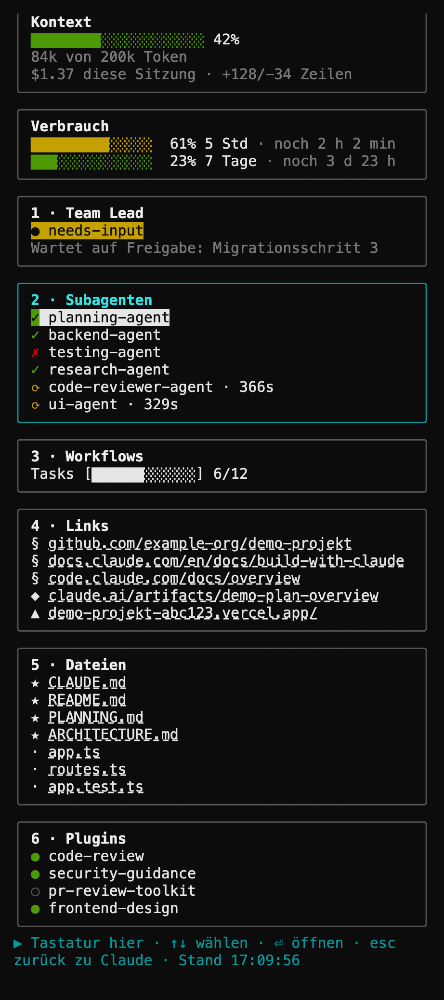

<!--
Status: ACTIVE
Purpose: Public README for the standalone claude-cockpit repository
-->

# Cockpit

[See it live](https://rcode-for-claude-code.vercel.app/cockpit.html)

A tmux sidebar dashboard for [Claude Code](https://code.claude.com) CLI. It runs
in a pane next to Claude Code and shows two always-on info cards (context,
usage) plus seven numbered, operable cards (Model & Effort, Team Lead,
Subagents, Workflows, Links, Files, Plugins) fed by Claude Code's own hooks,
its session transcript, and `claude agents --json`.


*Demo data — sample session shown for illustration.*


*Demo data — sample session shown for illustration.*


*Demo data — sample session shown for illustration.*

## What it is

- **Two info cards** (no number): Context and Usage. Nothing to select there,
  so they carry no shortcut.
- **Seven operable cards** (1–7): Model & Effort, Team Lead, Subagents,
  Workflows, Links, Files, Plugins. Only numbered cards are reachable via ⌘1–7.
- **Workflows** stacks up to two blocks, each with an overall bar and one row
  per task (full = done, empty = open, a travelling two-cell block = running
  — a task reports a state, not a percentage, so the bar never fakes one).
  **Tasks** reads Claude Code's own task list (`TaskCreate`/`TaskUpdate`) and
  only appears when the model chooses to keep one. **Welle** ("wave") is
  derived from the `SubagentStart`/`SubagentStop` hook events instead — one
  row per subagent — which fire deterministically on every run regardless of
  the model's choices, so it shows up in every session that dispatches
  subagents, task list or not.
- Data sources: Claude Code hooks (`SessionStart`, `PreToolUse`,
  `PostToolUse`, `Stop`, `SubagentStop`) write an events log the dashboard
  polls; the session transcript and `claude agents --json` fill in the rest;
  the status line writes context/usage numbers to a per-session file (see
  `cockpit-event.sh` and `statusline/statusline.sh` in this repo).

## Requirements

- **macOS.** The launcher (`bin/cockpit`) and keybinding setup below are
  macOS/Ghostty-specific.
- **[Ghostty](https://ghostty.org)** as the terminal you actually run the
  session in (not merely installed) — Ghostty is what turns ⌘1–7 into an
  escape sequence tmux can route to the dashboard pane. Terminal.app cannot
  send ⌘1–7 to Cockpit (it reserves ⌘1–9 for its own window/tab switching),
  so `bin/cockpit` warns loudly at startup (without aborting) if
  `$TERM_PROGRAM` isn't `ghostty`. The mouse (see below) works regardless of
  terminal.
- **tmux ≥ 3.3** (developed and tested against 3.7b).
- **Node.js ≥ 22** (no strict version is pinned in `package.json`, but the
  installer below checks for 22+).
- **[Homebrew](https://brew.sh)**, **git**, and **jq** — used to install the
  above and to merge Cockpit's configuration into your own.

## Installation

The installer brings a machine to exactly the state described in this
README: Ghostty, tmux, Node, jq, a full local copy of Cockpit, its Claude
Code hooks and status lines, its Ghostty keybindings, and its color theme.
It shows you the full plan and the current state of every step, asks once
before writing anything, and is safe to re-run (a second run reports
"nothing to do" everywhere).

```bash
bash <(curl -fsSL https://raw.githubusercontent.com/emanuelrechsteiner/claude-cockpit/main/install.sh)
```

Flags: `--dry-run` (show the plan and current state, change nothing),
`--yes`/`-y` (skip the single confirmation prompt), `--help`.

### What the installer does

1. Verifies macOS (required — the launcher and keybindings are
   macOS/Ghostty-specific) and that Homebrew is installed (aborts with the
   install link at [brew.sh](https://brew.sh) if it's missing — nothing is
   done halfway).
2. Installs Ghostty via `brew install --cask ghostty` if missing.
3. Installs tmux ≥ 3.3 via `brew install tmux` if missing or older.
4. Installs Node.js ≥ 22 via `brew install node` if missing or older.
5. Installs jq via `brew install jq` if missing.
6. Gets the Cockpit source at `~/.claude/cockpit` (clones it, or updates it
   with `git pull --ff-only` if it's already a checkout there).
7. Runs `npm install` inside that copy.
8. Puts the `cockpit` command on `PATH` (a symlink to `bin/cockpit`).
9. Registers Cockpit's hooks and status lines in
   `~/.claude/settings.json` — merging into your existing file (backed up
   first) rather than overwriting it; see "Register the hooks and status
   line" below for exactly what gets added.
10. Installs the `rcode` Ghostty color theme.
11. Adds Cockpit's ⌘1–7 keybindings and enables the `rcode` theme in
    `~/.config/ghostty/config` (backed up first).

Every step prints its current state ("present ✓", "missing → will
install", …) before you're asked to confirm, and one line for whatever it
actually did afterward. A conflicting pre-existing status line is never
silently replaced — the installer reports it and asks before overwriting.

### Manual setup

If you'd rather do it yourself (or just want to see exactly what the
installer automates), here is the same set of steps by hand.

Clone Cockpit as a full local copy at `~/.claude/cockpit` — both the
launcher (`bin/cockpit`) and the event hook (`hooks/cockpit-event.sh`)
resolve their own location from `$HOME/.claude/cockpit` by default
(overridable via `$COCKPIT_DIR`):

```bash
git clone https://github.com/emanuelrechsteiner/claude-cockpit.git ~/.claude/cockpit
cd ~/.claude/cockpit
npm install
```

Put the `cockpit` command on your `PATH` (adjust the target directory to
wherever your `PATH` already looks, e.g. Homebrew's `bin`):

```bash
ln -s ~/.claude/cockpit/bin/cockpit "$(brew --prefix)/bin/cockpit"
```

#### Register the hooks and status line

Cockpit observes Claude Code entirely through hooks and a status-line script
registered in Claude Code's `~/.claude/settings.json` — it does not patch
Claude Code itself. Merge the fragment in
[`config/claude-settings-snippet.json`](config/claude-settings-snippet.json)
into your own `settings.json`: for each `hooks.<Event>` entry, either add the
whole matcher block if you don't already have one for that event/matcher, or
append the one `cockpit-event.sh` command into your existing matcher's
`hooks` array. The `statusLine` and `subagentStatusLine` entries replace (or
become) your status-line commands; if you already run a different status
line, keep it and point Cockpit's data collector at that script's output
instead (see `statusline/statusline.sh` and `statusline/subagent-statusline.sh`).

The snippet registers 10 things in total: 8 hook entries (`SessionStart` ×2,
`PreToolUse`, `PostToolUse` ×3, `Stop`, `SubagentStop`) plus the `statusLine`
and `subagentStatusLine` commands.

#### Ghostty keybindings and color theme

Append [`config/ghostty-snippet.conf`](config/ghostty-snippet.conf) to
`~/.config/ghostty/config` — this is what turns ⌘1–7 into the escape
sequences tmux routes to the dashboard pane.

Install the `rcode` Ghostty color theme (the palette the screenshots above
use — the dashboard draws with the terminal's named colors, so this is what
makes borders/focus/status colors match the design):

```bash
mkdir -p ~/.config/ghostty/themes
cp config/ghostty-theme-rcode ~/.config/ghostty/themes/rcode
echo 'theme = rcode' >> ~/.config/ghostty/config
```

Then reload Ghostty's config with **⌘+Shift+,** (`reload_config`) — a plain
restart of the terminal is not required, but a config file left unreloaded
is; Ghostty keeps running on the config it had at launch until you send
this.

## Uninstall

1. Remove the `cockpit` symlink: `rm "$(brew --prefix)/bin/cockpit"` (or
   wherever you put it).
2. Remove the 8 hook entries, the `statusLine`, and the `subagentStatusLine`
   from `~/.claude/settings.json` (or restore it from the `.bak-*` file the
   installer left next to it).
3. Remove the 14 `keybind = ` lines and the `theme = rcode` line from
   `~/.config/ghostty/config` (or restore it from its own `.bak-*` file).
4. `rm -rf ~/.claude/cockpit ~/.config/ghostty/themes/rcode`.

## Usage

```bash
cd <your-project>
cockpit          # opens tmux: Claude Code on the left, the dashboard on the right
```

**Focus follows the card** (since the underlying framework's 2026-08-04
change): pressing ⌘1–7 both selects a card and moves keyboard focus to the
dashboard pane, so arrow keys and Enter act on it immediately, GUI-panel
style. Esc returns focus to Claude. A focused card is shown in cyan, and the
footer reads "▶ keyboard here" while focus is on the dashboard.

| Key | Effect |
|---|---|
| ⌘+1..7 | Focus a card **and** move the keyboard to the dashboard (from any pane) |
| ↑ ↓ | Select an entry |
| ⏎ | Open the selected link/file; on the Plugins card: open/run the action bar |
| ← → | Choose a plugin action (enable/disable/update/reauth) |
| Esc | Close the action bar, or — if none is open — release the card and return focus to Claude |
| q | Quit the dashboard — only when no card is selected (otherwise a typed word containing "q" would quit it) |
| any other letter | You meant Claude: focus returns and the character is forwarded left — nothing is lost |
| ⌘+Click | Open an OSC-8 link directly |
| Click (mouse) | Focus that pane — an alternative to ⌘1–7, works regardless of which terminal you're in |
| Drag the divider | Freely resize the two panes |
| Shift+Click/drag (Ghostty) | Select text natively instead of reporting the click to tmux |

Markdown files open via Enter with "MD Viewer.app" if installed; everything
else with `open`.

## Known limits

- **Plugin changes take effect only from the next Claude Code session** — a
  running session only loads plugins at startup. The card marks this as
  "takes effect next session".
- **Re-auth** triggers `claude mcp login <server>`; the actual login happens
  in your browser.
- **Link/file detection is a young heuristic** — tune `config/rules.json`
  (patterns for artifacts/previews/sources, candidate file names).
- **Team Lead card:** `claude agents --json` doesn't always return a `state`
  field; without one, "working" is assumed.
- **Usage card requires a Claude.ai subscription plan.** `rate_limits` is
  only returned to Pro/Max accounts, and only after a session's first API
  response; either window (5h / 7d) can be individually absent. Missing
  values are shown as "not yet available" — **never as 0%**, which would be
  a false claim.
- **Context and usage numbers are only as fresh as the status line.** They
  update only while Claude is actively working; once a session goes idle,
  the numbers age and are marked stale after 120 seconds.
- **After a window resize, the pane can stay blank for up to 2 seconds**
  until the next poll redraws it — the trade-off for avoiding leftover
  "ghost frames" (see below).
- **Ghost frames are mitigated, not eliminated.** [Ink](https://github.com/vadimdemedes/ink)'s
  own docs still warn about ghost lines on narrowing, and its line-count
  tracking remains column-unaware on window resize (a known open Ink issue)
  — a manual screen-wipe handler is the second, independent safeguard this
  dashboard relies on in addition to Ink's own resize handling.

## Companion framework

Cockpit was built alongside, and reads state produced by,
[claude-rcode](https://github.com/emanuelrechsteiner/claude-rcode) — a
Claude Code development framework (rules, agents, hooks, skills). Cockpit
itself has no hard dependency on it; the Team Lead / Subagents / Workflows
cards are simply most useful in a project using that framework's
orchestration conventions.

## License

MIT — see [LICENSE](LICENSE).
